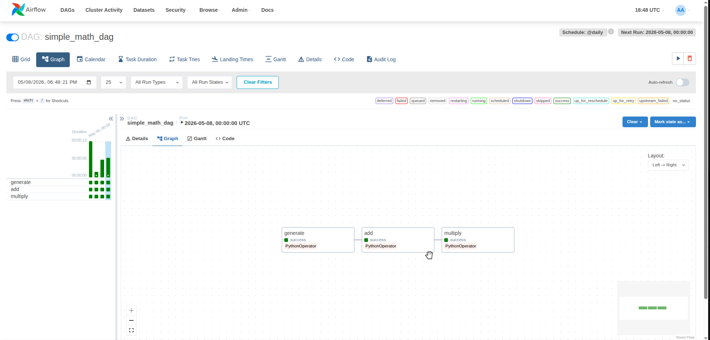

# Airflow DAG: my_first_dag

## 📝 Описание DAG

### Основные характеристики

| Параметр | Значение |
|----------|----------|
| **ID DAG** | `my_first_dag` |
| **Владелец** | me |
| **Описание** | Простой пример DAG |
| **Расписание** | `@daily` (ежедневно в 00:00) |
| **Начальная дата** | 1 января 2024 года |
| **Повторы при ошибке** | 2 попытки |
| **Задержка между повторами** | 5 минут |

**Stages:**
- generate: генерация рандомных чисел
- add: суммирование
- multiply: умножение

### Параметры конфигурации

- **`catchup=False`** — отключает выполнение пропущенных запусков
- **`retries=2`** — при ошибке выполнения задачи будет выполнено 2 повторные попытки.
- **`retry_delay=timedelta(minutes=5)`** — между повторными попытками будет пауза в 5 минут.

### Демонстрация работы
Airflow web


## Деплой сервиса
```
docker compose up -d
```
