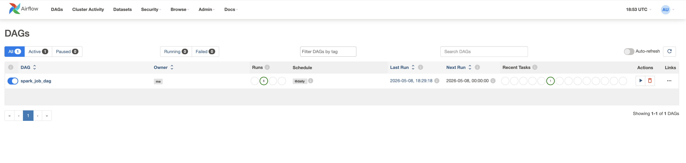

# Airflow DAG: my_first_dag


## 📂 Содержимое DAG

**Имя DAG:** `spark_job_dag`

### Параметры DAG

| Параметр | Значение | Описание |
|----------|----------|----------|
| `owner` | `me` | Владелец DAG |
| `retries` | `2` | Количество повторных попыток при ошибке |
| `retry_delay` | `5 minutes` | Задержка между попытками |
| `start_date` | `2024-01-01` | Дата начала работы |
| `schedule_interval` | `@daily` | Запуск ежедневно в 00:00 |
| `catchup` | `False` | Не выполнять пропущенные запуски |

### Задачи DAG

| task_id | Оператор | Описание |
|---------|----------|----------|
| `run_spark_job` | `SparkSubmitOperator` | Запускает PySpark приложение из `/opt/airflow/spark/main.py` |


## Деплой сервиса

```
docker compose up -d
```

### Доступ к UI-сервисам
Airflow UI	http://localhost:8081
Spark Master UI	http://localhost:4040

### Запуск DAG
1. Переходим на http://localhost:8081
2. Включаем spark_job_dag через переключатель
3. Триггерим DAG ("Trigger DAG)

### Демонстрация работы
