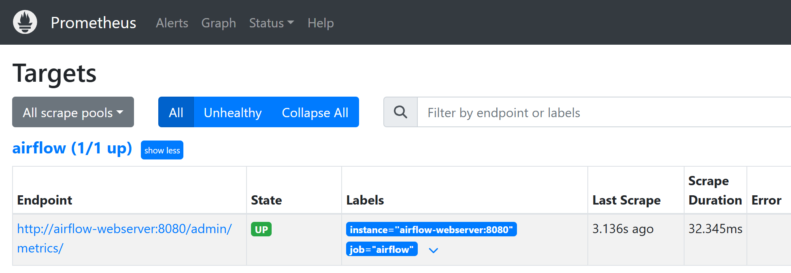
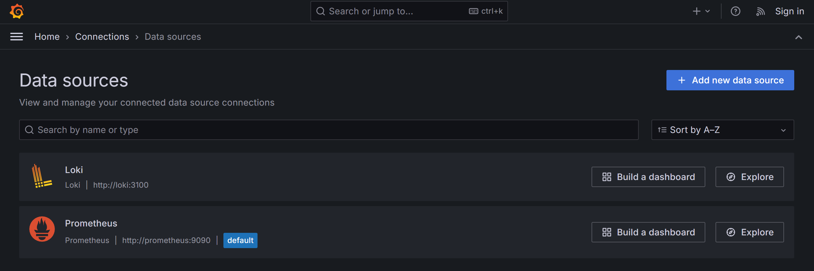
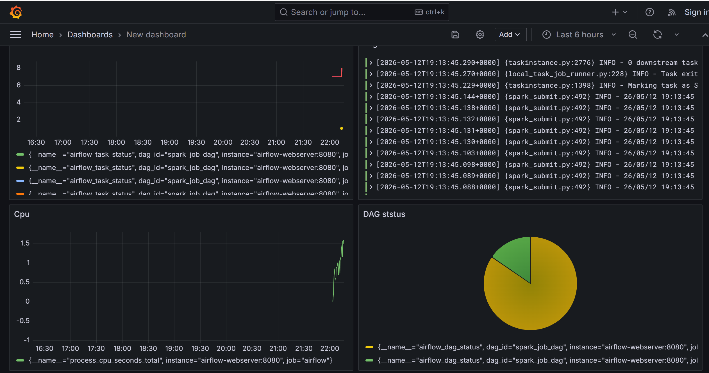

# lab4

## Сервисы

| Сервис | URL | Назначение |
|---|---|---|
| Airflow UI | http://localhost:8081 | Управление DAG и просмотр task logs |
| Spark Master UI | http://localhost:4040 | Просмотр Spark master |
| Loki | http://localhost:3100 | Хранилище логов |
| Prometheus | http://localhost:9090 | Сбор и поиск метрик |
| Grafana | http://localhost:3000 | Дашборды, Explore, визуализация |


### Зависимости между контейнерами

```text
postgres -> airflow-init -> airflow-webserver
                         -> airflow-scheduler

spark-master -> spark-worker
spark-master -> airflow-init / airflow-scheduler

loki -> alloy
airflow-webserver -> prometheus
loki + prometheus -> grafana
```


### Spark

Spark connection создается автоматически при запуске `airflow-init`:

```bash
airflow connections add spark_default --conn-type spark --conn-host spark://spark-master --conn-port 7077
```

### Prometheus



### Grafana

Datasources создаются автоматически через provisioning:

- [grafana/provisioning/datasources/datasources.yml](./grafana/provisioning/datasources/datasources.yml)



## Результаты


